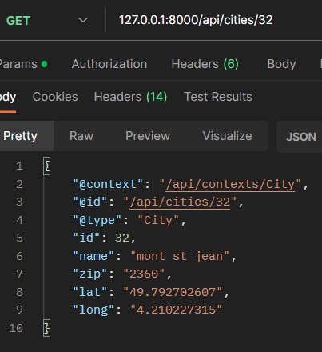

##COMMENT UTiliser l'API cities-api


Comment accéder aux données d’adresses ?
Il existe 2 méthodes pour accéder aux données

Récupérer directement les données.
Utiliser l’API de recherche: on passe un fichier avec une liste d’adresse, une par ligne et on retourne la première adresse retournée pour chacun des lignes.


dans votre Application de test (exemple: POSTMAN) rentrer apres votre url de serveur

```bash
votreURL/api/cities
```

exemple :

```bash
127.0.0:8000/api/cities
```
 cela vous retourne comme résultat


si vous souhaitez cibler une id en particulier il suffit de renseigner le numéro de l'id pour qu'il affiche seulement celui-ci:

```bash
votreURL/api/cities/{IDsouhaité}
```

exemple :
```bash
127.0.0:8000/api/cities/{id}
```

cela vous retourne comme résultat : 

