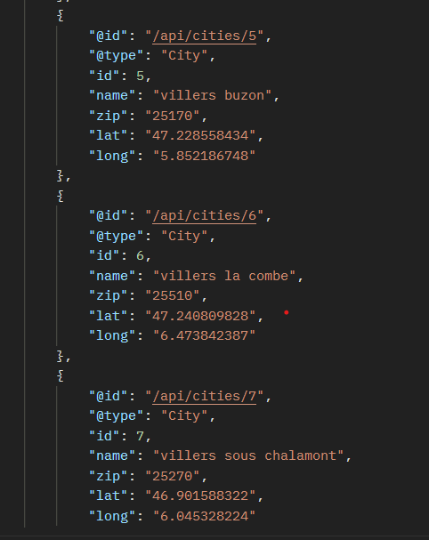
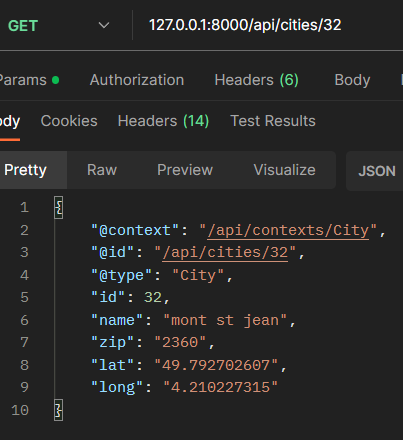

#Création d'un projet Symfony et installation des dépendances
Créez un nouveau projet Symfony en utilisant la commande suivante :

```bash 
symfony new cities-api
```

Installez le bundle Maker en utilisant Composer (pour créer facilement des fichiers comme les contrôleurs et les entités) :


```bash
composer require symfony/maker-bundle --dev
```

Installez le pack ORM pour travailler avec la base de données :

```bash
composer require symfony/orm-pack
 ```

Créez un contrôleur en remplaçant "nomdufichier" par le nom de votre choix :

```bash
symfony console make:controller "nomdufichier"
```

Installez les outils de gestion des fixtures (données de test) :

```bash
composer require --dev orm-fixtures
```

Créez une entité en remplaçant "nom-de-l'entité" par le nom de votre choix :

```bash
symfony console make:entity "nom-de-l'entité"
```

Configurez la connexion à votre base de données en éditant le fichier .env.

Créez la base de données en utilisant la commande Doctrine :


```bash
symfony console doctrine:database:create
```
Créez une migration pour définir la structure de votre base de données :


```bash
symfony console make:migration
```
Appliquez la migration pour mettre à jour la base de données :


```bash
symfony console doctrine:migrations:migrate
```
Chargez les données de test si nécessaire en utilisant les fixtures :


```bash
symfony console doctrine:fixtures:load
```
Installation du composant API Platform et configuration de l'API
Installez le composant API Platform :


```bash
symfony console doctrine:fixtures:load
```
Ajoutez l'attribut #[ApiResource] au-dessous de la classe de l'entité que vous souhaitez exposer en tant que ressource API. Par exemple :

```bash

#[ApiResource]
class VotreEntite
{
    // ...
}
```
Vous pouvez maintenant commencer à définir vos endpoints API et à personnaliser les réponses en fonction de vos besoins.

N'oubliez pas d'adapter les noms des classes, des entités et d'autres éléments selon votre application. Cette notice vous donne une base solide pour commencer à construire votre API Symfony avec le composant API Platform.


##COMMENT UTiliser l'API cities-api


Comment accéder aux données d’adresses ?
Il existe 2 méthodes pour accéder aux données

Récupérer directement les données.
Utiliser l’API de recherche: on passe un fichier avec une liste d’adresse, une par ligne et on retourne la première adresse retournée pour chacun des lignes.


dans votre Application de test (exemple: POSTMAN) rentrer apres votre url de serveur

```bash
votreURL/api/cities
```

exemple :

```bash
127.0.0:8000/api/cities
```
 cela vous retourne comme résultat




si vous souhaitez cibler une id en particulier il suffit de renseigner le numéro de l'id pour qu'il affiche seulement celui-ci:

```bash
votreURL/api/cities/{IDsouhaité}
```

exemple :
```bash
127.0.0:8000/api/cities/{id}
```

cela vous retourne comme résultat : 

